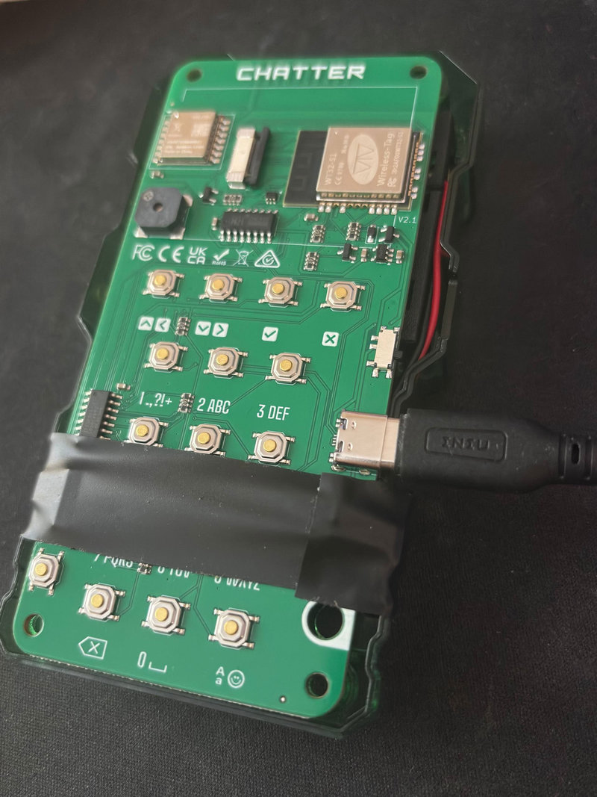

# Chatter 2.0 — Headless Wi-Fi Mode



This branch (`headless-wifi`) is a special build for a **device whose LCD is
physically broken**. Instead of scrapping the unit, it boots with **no screen and
no keypad UI** and is controlled entirely from a phone browser over Wi-Fi.

> **This branch is for broken devices** `master` is untouched — the other
> devices keep building and behaving exactly as before. Build/flash the broken unit
> from this branch; build everything else from `master`.

---

## Why this exists

One Chatter's display died. Everything *behind* the screen — the LoRa radio, the
message store, friends, broadcast, retry-until-ACK, pairing — still works perfectly;
the only thing gone is the way to *see* and *drive* it. So this build:

- **Skips all display/LVGL setup** (no splash, no menus, no `IntroScreen`, no keypad
  input listener). Saves the power the backlight + rendering would have used.
- **Brings up the messaging stack exactly as the normal firmware does** — `Storage`,
  `LoRaService`, `MessageService`, `ProfileService`, `PairService` are all reused
  unmodified. They were already decoupled from the UI.
- **Starts a Wi-Fi Access Point + small web server** as the new control surface.

You connect your phone to the device's Wi-Fi network and visit its web page to add
friends, open conversations, send messages, broadcast, and pair new devices —
everything the screen-equipped units can do.

---

## The LCD can be physically unplugged

**You can run this device with the LCD ribbon removed/disconnected — it boots fine.**

The vendor display driver writes its init sequence one-way over a dedicated SPI bus
and never reads back from the panel (no MISO, no busy line, `readable = false`). There
is no handshake that can fail and nothing to block on, so a missing or disconnected
panel is simply ignored. The display SPI bus is also separate from the LoRa radio's
bus, so removing the screen can't disturb radio communication.

Removing the dead panel is optional, but it's safe — and it saves a little power.

---

## Sound is the indicator (works great)

With no screen, the **buzzer is the only feedback channel**, so the build chirps short
non-blocking melodies for the events that matter:

| Event | Cue |
| --- | --- |
| Boot / AP is up | C5–E5–G5 **rising** chime — "I booted, Wi-Fi is live" |
| A phone connects to the AP | C5–G5 **rising** |
| A phone disconnects | G5–C5 **falling** |
| Battery dropping on backup power | E5–C5–G4 **falling** — check USB power |

Cues honor the global sound setting (silent if sound is turned off). The boot chime is
your confirmation that the firmware came up and the Access Point is broadcasting,
without needing to look at anything.

**Incoming messages still sound and still cancel by keypress.** The keypad/control
buttons are read over a shift register that's independent of the LCD, so they keep
working with the screen unplugged. An incoming message plays the usual continuous alert
melody, and pressing any physical button silences it — exactly like the screen-equipped
devices. (Only the *visual* UI was removed; the audio-alert + key-to-silence path is
unchanged.)

---

## How to use it

1. Build & flash this branch to the broken-LCD device (same Arduino IDE / CMake steps
   as the standard firmware — see [SETUP.md](SETUP.md)).
2. On boot you'll hear the **rising boot chime** and the serial monitor prints the AP
   name and URL.
3. On your phone, join the Wi-Fi network **`Chatter-XXXX`** (XXXX = last 4 hex of the
   device ID) using the password set in
   [`src/Services/WebUIService.cpp`](src/Services/WebUIService.cpp).
   > **Set a password of at least 8 characters** before flashing — WPA2 rejects
   > shorter ones and the AP won't come up secured.
4. Browse to **http://192.168.4.1/** — you'll get the friends list, conversations, a
   compose/send box, a broadcast button, and a pairing flow (scan → tap to pair). The
   header shows live **battery %, pack voltage, pending sends, connected clients, and
   uptime** (polled every 10 s). Watching the voltage trend is a handy way to gauge how
   fast Wi-Fi drains the pack when running on battery backup.

NOTE: iPhone users should turn Private Wi-Fi Address to OFF to reduce reconnection negotiation

### Web UI features

- **Friends & conversations** — avatar thumbnail, name, and last message per friend;
  tap to open the thread, compose and send.
- **My profile** (`me` link) — edit your **name**, pick from the 15 built-in **avatars**
  (rendered live in the browser — the firmware transcodes the device's LVGL image
  assets to BMP on the fly), and set your color hue. Saved back to the device profile.
- **Silence** (`silence` link) — stop an in-progress incoming-message alert from the
  phone, without walking over to press a key.
- **Delete** — remove a friend (and its whole conversation) or an individual message
  via the ✕ buttons. Per-record only; no bulk wipe.
- **Backup-power alert** — there is no USB/charge-detect pin, so the device infers power
  state from the battery gauge: if the charge falls past a threshold (it never does on
  USB power), it sounds a distinctive **falling cue** and shows an **"ON BATTERY"**
  banner — your signal that USB power was lost and the backup pack is draining.

---

## Loading the LittleFS assets (read this — new users will hit a trap)

The UI assets (avatars, meme pics) live in a **LittleFS** partition that is flashed
**separately** from the firmware. Two things bite first-time builders, and both show the
same symptom: the device boots but shows **broken/missing images** and its **profile name
is randomly regenerated on every reboot**. That means LittleFS mounted an *empty*
filesystem — your data never made it on, or it's in a format the device can't read.

### The version trap (why the "obvious" way fails)

The Chatter firmware mounts LittleFS using the Arduino **`LittleFS_esp32`** library (the
"lorol" library — header `LITTLEFS.h`). When you install it from the Arduino Library
Manager today you get a build using **littlefs `lfs` v2.4**, which reads only **on-disk
version 2.0** and is compiled with **`LFS_NAME_MAX = 64`**.

But the **`mklittlefs`** tool bundled with the modern ESP32 Arduino core (v4.x, littlefs
v2.11) builds images with **on-disk version 2.1** and **`name_max = 255`**. A v2.1 image
**cannot be mounted** by the v2.0 on-device library (it fails with `LFS_ERR_INVAL`), so the
firmware silently formats a blank filesystem instead. Result: broken images + resetting
profile. This is *not* a wiring or flashing problem — the image is simply built in a newer
format than the library understands.

### The reliable way (build a v2.0 image with the bundled script)

Instead of `mklittlefs`, this repo ships **[`tools/build_littlefs.py`](tools/build_littlefs.py)**,
which pins the on-disk version to **2.0** and `name_max` to **64** to match the device
library exactly. One-time setup, then build:

```bash
pip install littlefs-python
python tools/build_littlefs.py data littlefs.bin
```

### Flash it to the right partition — and the right device

1. **Build the firmware with Tools → Partition Scheme → "No OTA".** In that scheme LittleFS
   lives at **`0x211000`** (the default scheme puts it at `0x291000`, where the command
   below would *not* load it). Firmware and image must agree on the address.
2. **Flash the image, naming the port explicitly:**
   ```bash
   esptool --port COM3 --chip esp32 --baud 921600 write-flash -z 0x211000 littlefs.bin
   ```
   ⚠️ If you have **more than one Chatter / ESP32 plugged in**, always pass `--port`. Letting
   esptool auto-pick will happily flash a *different* board — check the printed MAC matches
   the device you're actually running. (Close the Arduino Serial Monitor first so the port
   is free.)
3. **Reboot and check the serial log.** A healthy mount prints:
   ```
   LittleFS mounted: ~110000 / 2027520 bytes used
   ```
   Non-zero "used" bytes = your assets are really on the device. `8192 / 2027520` means an
   empty (freshly-formatted) FS — go back and recheck the steps above. `LittleFS mount
   FAILED` means a version/partition mismatch.

> The harmless `SPIFFS failed` line early in the boot log comes from the CircuitMess
> library and can be ignored — this firmware uses LittleFS for everything and NVS for
> settings.

Full partition table and rationale are in **[SETUP.md](SETUP.md)**.

---

## What's intentionally **not** running

- **LVGL / display / theme / keypad input** — there's no screen to draw to.
- **Sleep & Shutdown services** — their low-battery and sleep paths are tied to the
  screen (`LVScreen::getCurrent()`, battery notification modals) and would crash with
  no screen ever created. An always-on Wi-Fi hub shouldn't sleep anyway.

If you intend to run this permanently on USB power **without a battery installed**, note
that the original boot-time dead-battery guard can deep-sleep the device if the battery
rail reads ~0 V. That guard is kept as-is on this branch; relax it if your hub has no
battery.

---

## Files specific to this branch

- [`Chatter-Firmware.ino`](Chatter-Firmware.ino) — headless boot path (no LVGL).
- [`src/Services/WebUIService.h`](src/Services/WebUIService.h) /
  [`src/Services/WebUIService.cpp`](src/Services/WebUIService.cpp) — Wi-Fi AP, HTTP API,
  embedded web page, and the buzzer cue system.

Everything else is the stock firmware, reused unchanged.
