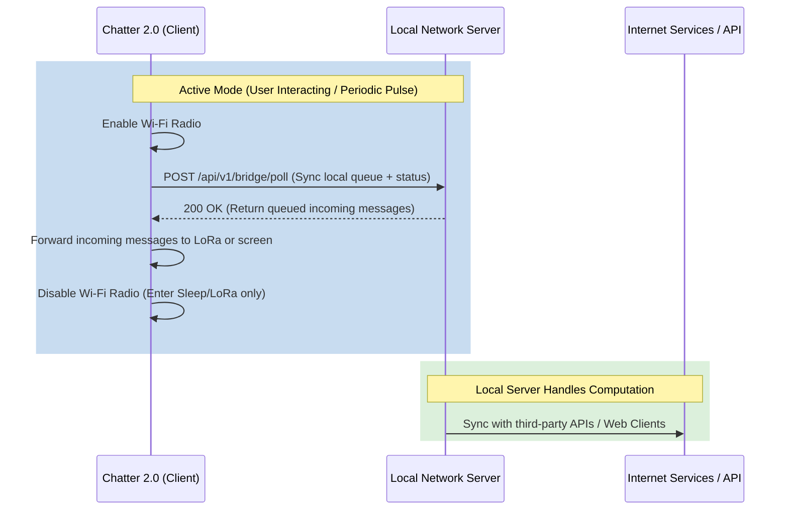

# Chatter 2.0 Wi-Fi Gateway & LoRa Bridge Proposal

This document outlines a lightweight Wi-Fi gateway architecture for Chatter 2.0. The design establishes a bridge between peer-to-peer LoRa networks and standard IP networks without requiring the Chatter 2.0 to act as an active web server.

---

## 1. Architectural Strategy

Rather than running a resource-heavy HTTP or WebSocket server directly on the ESP32 (which would deplete the heap and battery), the architecture uses a **Lightweight Client-Polling Model**.



### Roles and Division of Labor

* **Chatter 2.0 (Lightweight Bridge)**:
  * Remains primarily in low-power LoRa listening mode.
  * Connects to Wi-Fi only during user interactions or at scheduled background intervals.
  * Sends lightweight API requests (POST/GET) to a designated local server.
  * Forwards remote messages down to local peer-to-peer LoRa nodes.
* **Local Network Server (Heavy Lifting)**:
  * Runs on a dedicated local machine (e.g., Raspberry Pi, Home Assistant, local PC).
  * Hosts the web dashboards, manages client connections, performs message routing, and caches queues.
  * Exposes simple, stateless API endpoints for the Chatter device.

---

## 2. API Specifications & Data Structures

The Chatter client connects to the local server via standard RESTful endpoints.

### API Endpoints

| Endpoint | Method | Payload (JSON) | Description |
| :--- | :--- | :--- | :--- |
| `/api/v1/bridge/pulse` | `POST` | Device status, battery, uptime | Fast check-in to report status and retrieve pending message count. |
| `/api/v1/bridge/push` | `POST` | Array of outgoing LoRa packets | Uploads packets received from LoRa to be forwarded to the Internet. |
| `/api/v1/bridge/pull` | `GET` | (None) | Downloads pending messages queued on the server for local LoRa broadcast. |

### Client Check-in Payload Example (`/api/v1/bridge/pulse`)
```json
{
  "device_uid": 281474976710656,
  "battery_pct": 89,
  "signal_rssi": -68,
  "has_pending_lora_tx": true
}
```

---

## 3. Wi-Fi Power Duty-Cycle Policy

Wi-Fi is a major power drain on the ESP32. To conserve battery, we employ a dynamic duty-cycle model driven by user interactions.

```mermaid
stateDiagram-v2
    [*] --> Sleep_LoRa_Only : Default State
    Sleep_LoRa_Only --> Wi-Fi_Connecting : User Interacts (Keypad Press/Wake)
    Sleep_LoRa_Only --> Wi-Fi_Connecting : Timer Interval Expires (e.g., 15m)
    Wi-Fi_Connecting --> API_Synchronization : Wi-Fi Connected
    API_Synchronization --> Wi-Fi_Disconnecting : Data Sync Complete
    Wi-Fi_Disconnecting --> Sleep_LoRa_Only : Wi-Fi Disabled
```

### Connection State Table

| State / Trigger | Wi-Fi Radio | Action | Power Impact |
| :--- | :--- | :--- | :--- |
| **Idle (No Interaction)** | **Disabled** | Listen for incoming LoRa packets only | ~15mA |
| **Scheduled Wakeup** | **Enabled** | Quick API poll to pull queued messages, then disconnect | ~80-120mA (short burst) |
| **Active User Typing** | **Enabled** | Keep link open for near real-time internet delivery | ~120mA (sustained) |
| **User Inactivity (2m)** | **Disabled** | Gracefully disconnect and shut down Wi-Fi module | Powers down to Idle |

---

## 4. Class Definition: `GatewayService`

Below is the proposed implementation interface for the `GatewayService` to be integrated into the Chatter firmware architecture.

```cpp
#ifndef CHATTER_FIRMWARE_GATEWAYSERVICE_H
#define CHATTER_FIRMWARE_GATEWAYSERVICE_H

#include <Arduino.h>
#include <WiFi.h>
#include <Loop/LoopListener.h>
#include "../Types.hpp"

class GatewayService : public LoopListener {
public:
    GatewayService();
    virtual ~GatewayService();

    void begin();
    void loop(uint micros) override;

    // Triggered on user keypad or screen interactions
    void reportUserActivity();

    // Push local LoRa message to Internet Queue
    bool queueOutgoingMessage(const String& payload, UID_t recipient);

private:
    bool wifiActive = false;
    uint32_t lastActivityTime = 0;
    uint32_t lastPulseTime = 0;

    // Parameter configuration
    const uint32_t wifiTimeoutMs = 120000;    // Disconnect after 2 mins idle
    const uint32_t pulseIntervalMs = 900000;  // Poll every 15 mins

    void enableWiFi();
    void disableWiFi();
    void syncWithServer();
};

extern GatewayService Gateway;

#endif // CHATTER_FIRMWARE_GATEWAYSERVICE_H
```
