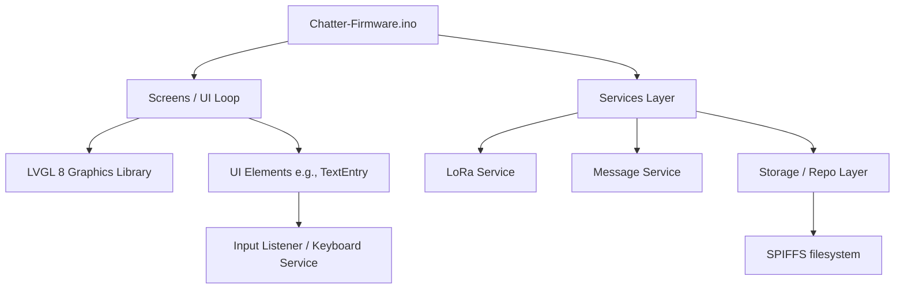

# Chatter-Firmware Architecture & Design Specifications

This document outlines the architecture, specifications, constraints, codebase structures, and development roadmaps for the Chatter 2.0 Green firmware. It serves as an onboarding guide for new agentic assistants and developers.

## 1. Platform & Hardware

The Chatter 2.0 is a peer-to-peer text communicator designed by CircuitMess. The platform characteristics are:

* **Microcontroller**: **ESP32-WROOM-32** (dual-core Tensilica Xtensa 32-bit LX6, 240 MHz, with 520 KB SRAM and external PSRAM/Flash).
* **Display**: Color LCD screen controlled via SPI.
* **Input Interface**: 10-key numeric keypad (`BTN_1` to `BTN_0`) mapping to standard multi-tap text entry, along with control buttons (`BTN_L` for backspace, `BTN_R` for Shift/Caps, and navigation directional buttons `BTN_LEFT/BTN_UP (same button)`, `BTN_RIGHT/BTN_DOWN (same button)`.  
* **Wireless Transceiver**: LoRa radio module running peer-to-peer encrypted wireless packets. **LoRa Transceiver**: LLCC68
* **Storage**: onboard Flash memory partitioned for ESP32 firmware and a SPIFFS (Serial Peripheral Interface Flash File System) partition holding UI assets, sound clips, and user data database files.
* **Audio**: Piezoelectric buzzer managed by a software tone-generation service.

---

## 2. Software Architecture Overview

The software is structured as an object-oriented C++ firmware utilizing the Arduino environment and the LVGL (Light and Versatile Graphics Library) version 8.

### Key Subsystems

1. **Loop & Event System (`LoopListener`, `InputListener`)**:
   
   * Uses cooperative multitasking. Components register themselves with the `LoopManager` to receive periodic CPU ticks (`loop(uint micros)`).
   * Keypad buttons map to low-level ISRs and debouncing logic, firing button pressed, released, and held events to active listeners.

2. **Storage Repository Layer (`Repo<T>`)**:
   
   * Located in [Repo.h](file:///c:/Users/subran/Documents/Scripts/Chatter-Firmware/src/Storage/Repo.h) and [Repo.cpp](file:///c:/Users/subran/Documents/Scripts/Chatter-Firmware/src/Storage/Repo.cpp).
   * Models subclass `Entity` and are saved to individual files under specific SPIFFS directories (e.g., `/repo/messages/`).
   * Features a caching map (`std::unordered_map<UID_t, fs::File>`) to avoid file system lookups when cached.

3. **Services Layer**:
   
   * **`LoRaService`**: Handles physical packet serialization, encryption, and low-level SPI radio interface operations.
   * **`MessageService`**: Handles application-level transmission, Retries, Acknowledgments (ACKs), and broadcast protocols.
   * **`BuzzerService`**: Non-blocking tone scheduler for notifications.
   * **`ProfileService`**: Keeps track of current local user credentials (nickname, avatar index).

4. **UI Elements (`src/Elements/`)**:
   
   * [TextEntry](file:///c:/Users/subran/Documents/Scripts/Chatter-Firmware/src/Elements/TextEntry.h) handles multi-tap input. It maps numeric key events into strings using a state-machine that cycles through corresponding letters (e.g. `BTN_2` cycles `a`, `b`, `c`, `2`) if pressed within a 1-second timeout.

---

## 3. Architecture Design Specifications

* **Non-blocking Services**: Avoid using `delay()` inside services or screen loops. Use elapsed millisecond checks (`millis()`) in `loop()` callbacks.
* **Asset Loading**: Icons, pictures, and font data are loaded from SPIFFS directly into LVGL canvas descriptors to minimize boot time and conserve heap memory.
* **Explicit Callback Events**: UI views communicate back to controller screens using custom LVGL event codes (e.g., `EV_ENTRY_DONE`, `EV_ENTRY_CANCEL`).

---

## 4. Platform & Memory Limitations

* **RAM Constraints**:
  * ESP32 has limited internal SRAM. Extensive use of dynamic structures (like `std::vector` or `std::string` reallocations) can cause memory fragmentation and crash the device.
  * The repository caching layer maintains open file handles. If too many files are open, file descriptor tables will overflow, causing storage operations to fail.
* **SPIFFS Constraints**:
  * SPIFFS is a flat filesystem. Searching for files scale linearly with the number of files. It is not suitable for high-density directory trees. Large files should be avoided, and caching indexes should be used where possible.
* **LoRa Bandwidth Constraints**:
  * LoRa transmission rates are extremely low. Large messages or images must be segmented and throttled.
  * Reliable communication relies on Retry-until-ACK loops, which can block the channel if too many retries occur simultaneously.

---

## 5. Current Code Highlights

* **Multi-tap Implementation**: Located in [TextEntry.cpp](file:///c:/Users/subran/Documents/Scripts/Chatter-Firmware/src/Elements/TextEntry.cpp#L213). Tracks the current button, active index, and press time.
* **T9 Database Header**: [t9_dict.h](file:///c:/Users/subran/Documents/Scripts/Chatter-Firmware/src/t9_dict.h) embeds `t9DictData` as a flat hex array containing `8249` sorted word definitions, taking roughly 145 KB of flash storage.
* **Dictionary Generation Script**: [gen_t9_dict.py](file:///c:/Users/subran/Documents/Scripts/Chatter-Firmware/tools/gen_t9_dict.py) parses a wordlist, sorts sequences numerically to allow binary search, and creates the C-header. *Note: The current file contains a NameError where it references `build_entries` (missing definition).*

---

## 6. Future Direction: T9 Predictive Text Integration

We aim to replace or augment the multi-tap interface with a T9 predictive text system.

### Goal A: Static Pre-Compiled Database using Weighted Trie

* **Concept**:
  Instead of a flat binary search dictionary that matches exact sequences, build a static prefix trie where each node represents a digit combination and holds a list of candidate words weighted by global english language frequency.
* **Trie Specifications**:
  * Precompiled via Python scripts into a compact binary format.
  * In-memory lookup: the firmware walks down the trie nodes as the user presses numeric keys, retrieving candidates in O(L) time where L is word length.
  * Emits top predictions immediately without full string comparisons.

### Goal B: Dynamic User Custom Frequency Database

* **Concept**:
  As users type new words using multi-tap or select existing candidates, the device records these additions/updates in a custom local frequency database.
* **Dynamic Specifications**:
  * Saved to SPIFFS/NVS storage so it persists across reboots.
  * T9-readable: when predictive lookup runs, search results from the static trie are combined with high-frequency matches from the custom user dictionary.
  * Learns from typing context: if a user types a word frequently, its ranking is bumped to the top of the recommendation list.
